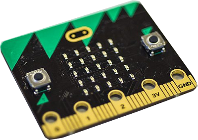
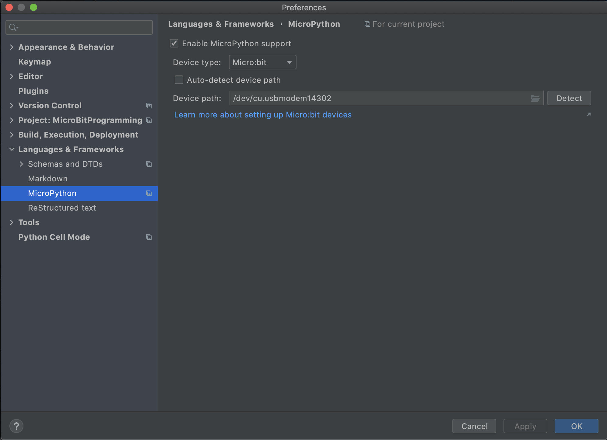
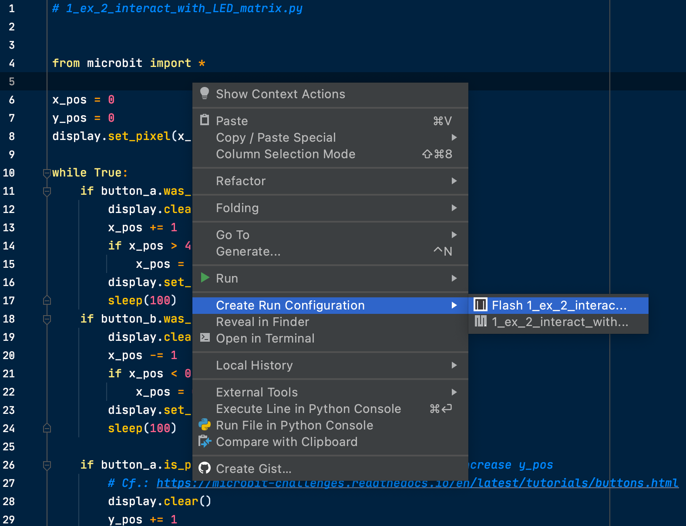

# MicroPython for micro:bit
Bundle of MicroPython codes for micro:bit to get used to simple robotics
concepts and activities.

## Table of contents
* [1. Description](#1-description)
* [2. Getting started](#2-getting-started)
    * [2.1 Dependencies](#21-dependencies)
    * [2.2 Installing](#22-installing)
    * [2.3 Executing program](#23-executing-program)
* [3. Version history](#3-version-history)

<!-- toc -->

## 1. Description
The repository `MicroPython for micro:bit` gathers samples of code to learn to program micro:bit boards. It consists of 5 sections of increasing difficulty:
1. Introduction
2. GPIO
3. Control systems
4. Remote controls
5. Robot design

Each part comes with a video presenting its final result. The `MobileRoboticsWithMicrobit_SummerSchool2020.pdf`
file (elaborated by my colleague Amaury Dame) serves as a guidance documentation.

## 2. Getting started

### 2.1 Dependencies
* Tested on macOS Big Sur version 11.0.1
* Python 3.6
* PyCharm CE 2020.2 (with [MicroPython plugin](https://github.com/vlasovskikh/intellij-micropython))

### 2.2 Installing
`pip install -r requirements.txt`

### 2.3 Executing program
1. Make sure to have plugged the micro:bit board into your computer and set the
correct device path into `PyCharm > Preferences… > Languages & Frameworks > MicroPython`.
For this, simply plug your micro:bit into your computer using a USB cable and
type following Terminal command to get the micro:bit device path:
`ls /dev/cu.usb*`. For me, it was `/dev/cu.usbmodem14302`: 

2. Configure your file by right-clicking and creating a MicroPython Run
Configuration: 

3. Run your file by clicking on the green "run triangle": 

## 3. Version history
* 0.1
    * Initial release